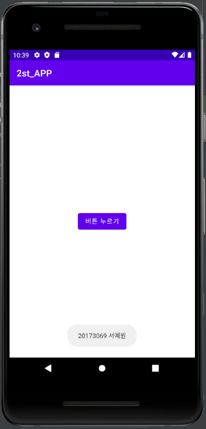
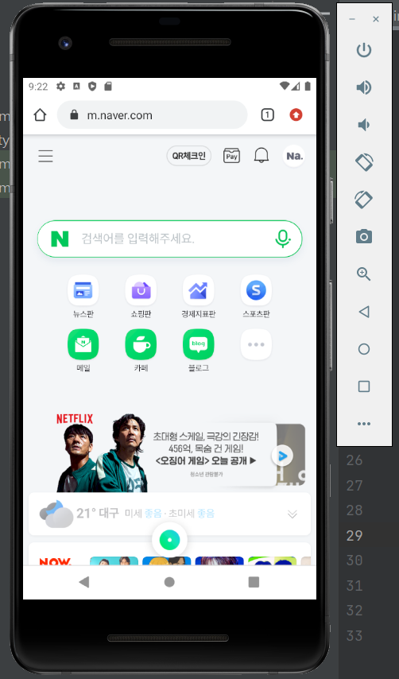
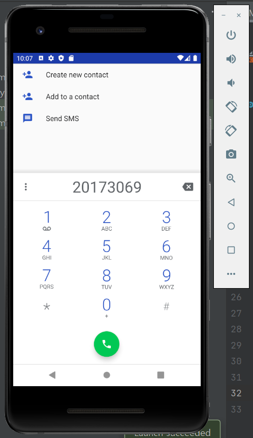
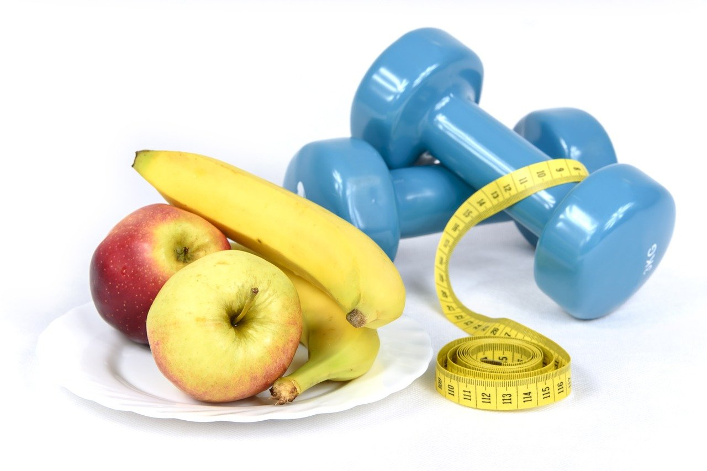

# 캡스톤디자인 주간 B반
## 1주차

## 2주차
   </img>
## 3주차
   </img>
   </img>
## 4주차
   #### 식단뿐만 아니라 운동까지 도와주고 추천해 주는 앱
   </img>
코로나로 인해 집에만 있다보니 배달음식도 많이 시켜먹고 움직이는 활동량도 적어져서 무기력해짐 때문에 요즘 사람들이 건강에 관심을 많이 갖고 다이어트를 합니다. 특히 체지방을 감량하기에 제일 중요한 식단관리를 기록하고, 또는 추천해주고 도와주는 앱이 많습니다 하지만 저도 다이어트하면서 앱을 많이 써보았지만 항상 한가지가 너무 아쉬웠습니다. 바로 운동을 하는 것입니다 유튜브에 수많은 운동영상이 있지만 하다보면 이게 자세가 맞는건가 싶고, 나에게 맞는 운동영상을 찾느라 시간만 가고 금방 포기하기 일쑤 였습니다. 그래서 제가 생각한 아이디어는 사람들중에서도 체질이나 특징들은 다 다르기에 여러 카테고리를 만들어서 (ex. 마른비만,근육부족,근육부족비만,고도비만,복부비만,상체.하체비만 등등) 유튜브에 있는 운동영상의 링크를 연결해서 클릭하면 유튜브로 이동해 영상을 볼 수 있게 해주는 것입니다. 물론 식단도 ai가 메뉴를 추천해주거나 따로 자기가 기록하고 칼로리 계산도 하고 
   
   
